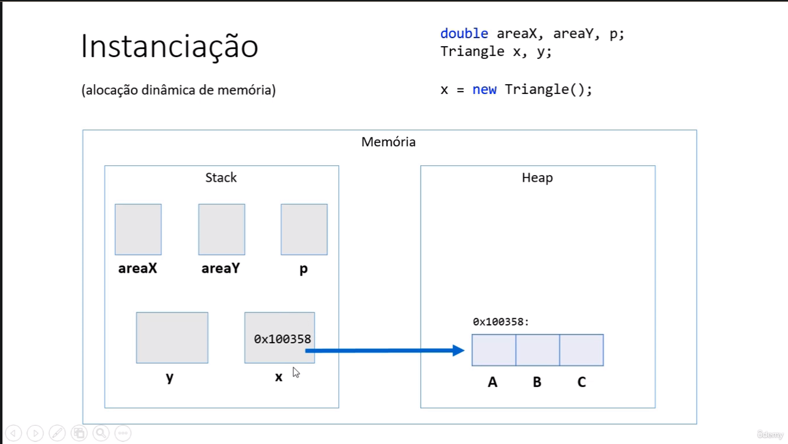
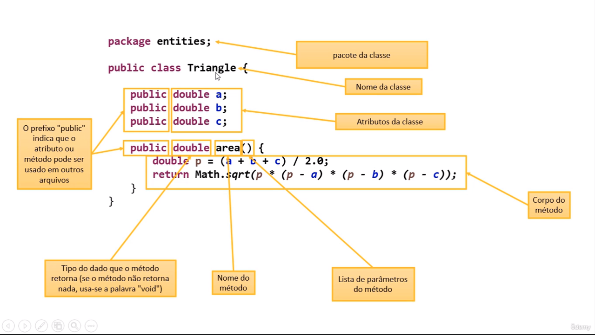
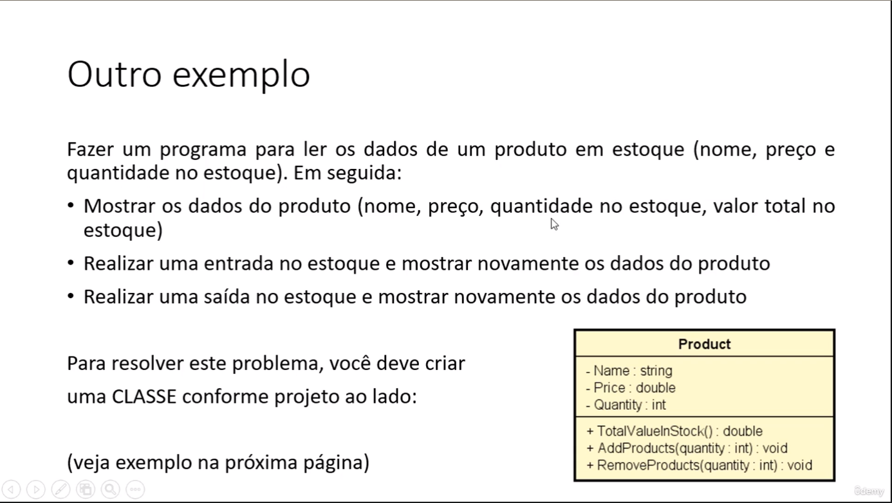
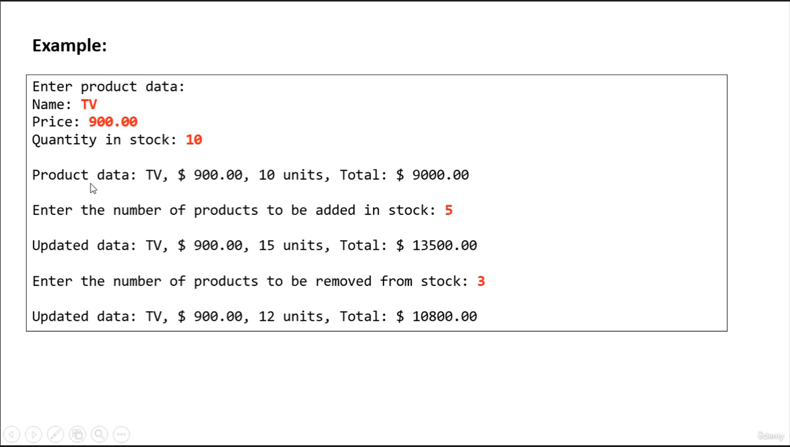

# PROGRAMAÇÃO ORIENTADA A OBJETO.

## Classe
- É um tipo estruturado que pode conter (membros):
    - Atributos (dados / campos)
    - Métodos (funcões / operacões)
* A classe também pode prover muitos outros recursos, tais como:
    - Construtores 
    - Sobrecarga
    - Encapsulamento
    - Heranca
    -  Polimorfismo

- Exemplos: 
    - Entidades: Produto, Cliente, Triangulo
    - Servicos: ProdutoService, ClienteService, EmailService, StorageService
    - Controladores: ProdutoController, ClienteController
    - Utilitários: Calculadora, Compactador
    - Outros (views, repositórios, gerenciadores, etc.)

## Classes, objetos, atributos
- classe: é a definicão do tipo.
- Objetos: são instâncias da classe.

### Discussão: 

Quais os benefícios de se calcular a área de um triângulo por meio de uma MÉTODO 
dentro da CLASSE Triangle?

1) Reaproveitamento de código: nós eliminamos o código repetido (cálculo das áreas
dos trŝngulod x e y) no programa principal.
2) Delegacão de responsabilidades: quem deve ser responsável por saber como calcular a área
de um triângulo é o próprio triângulo. A lógica do cálculo da área não deve estar em
outro lugar.

isso se chama principio de COESÃO.

# Segundo exercícios

### 
### Discussão
- Toda classe JAva é uma subclasse da classe Object
- Object possui os seguintes métodos:
  - getClass = retorna o tipo de objeto
  - equals = compara se o objeto é igual a outro
  - hashCode = retorna um código hash do objeto
  - toString = converte o objeto para string
