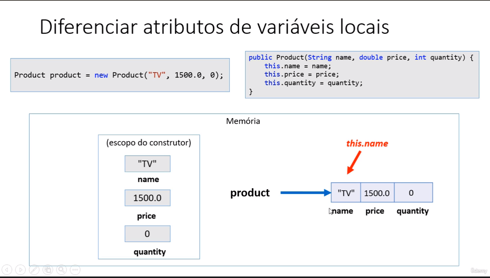
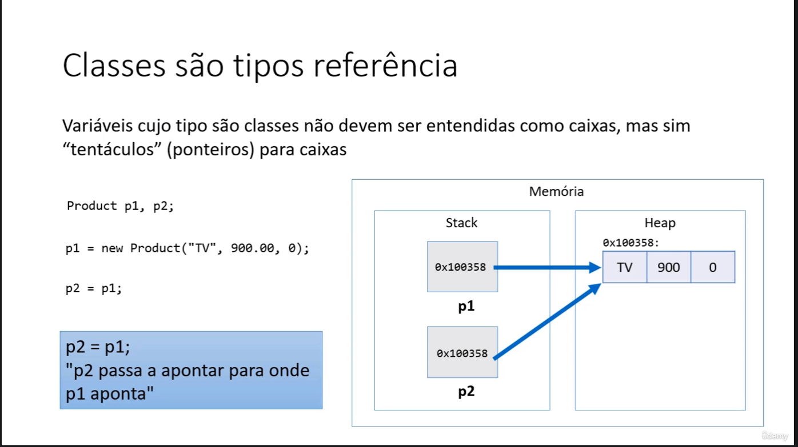
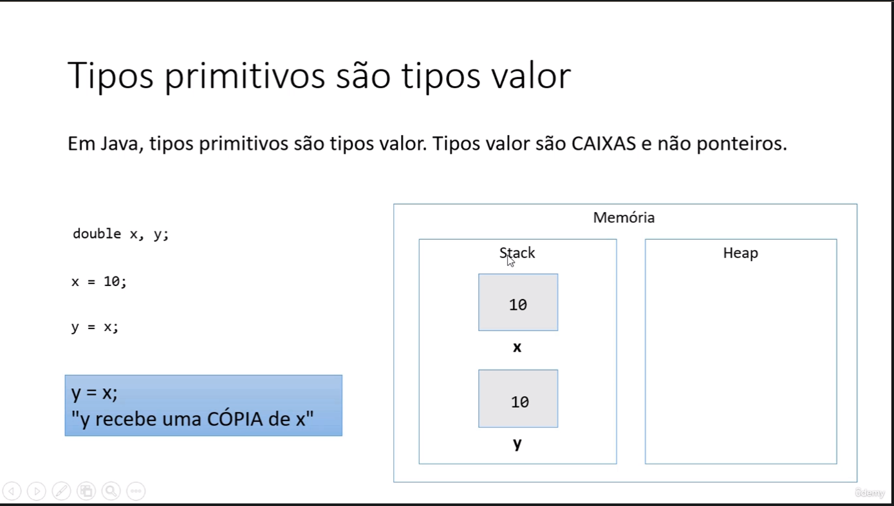
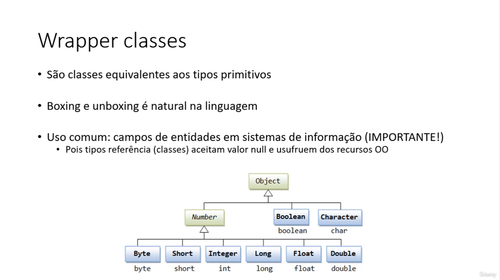
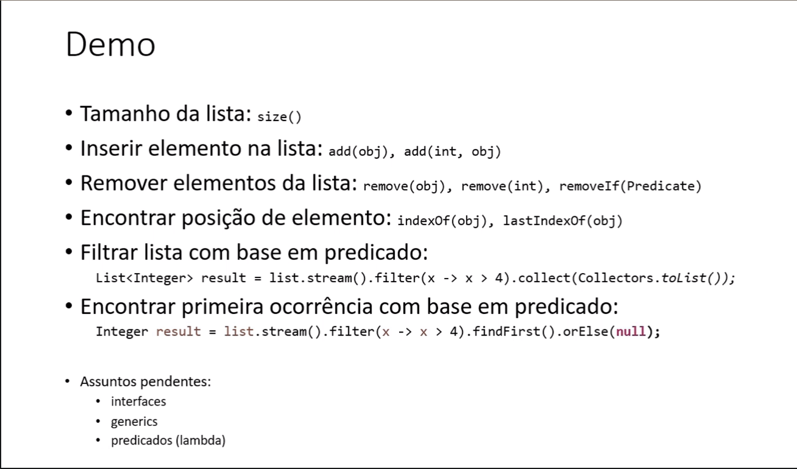
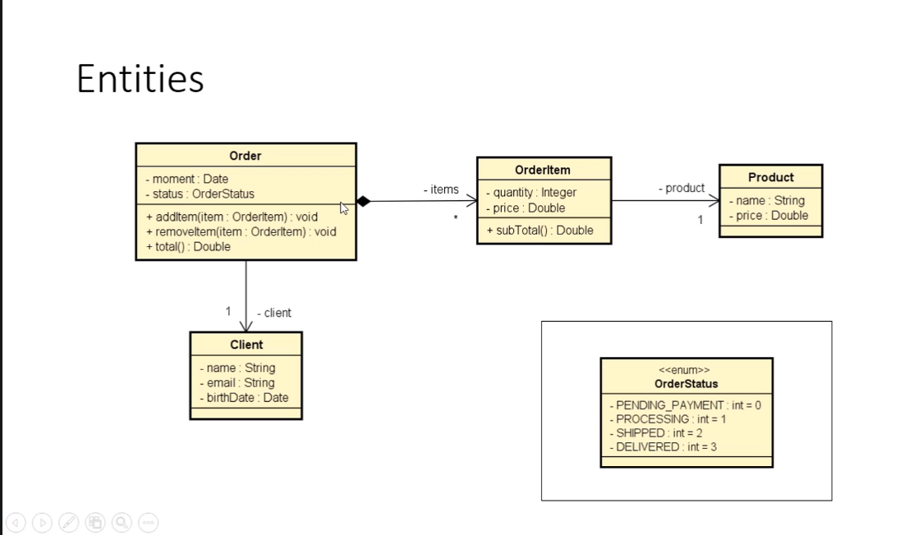
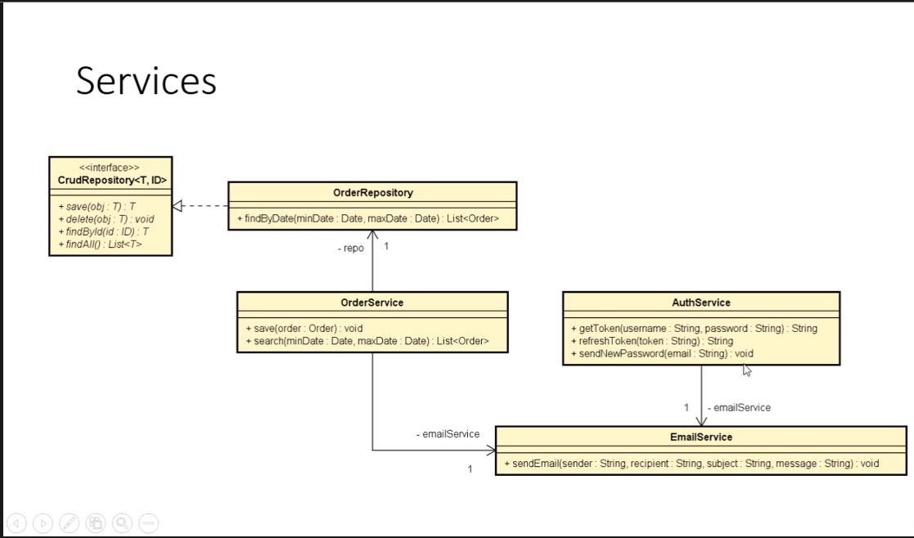
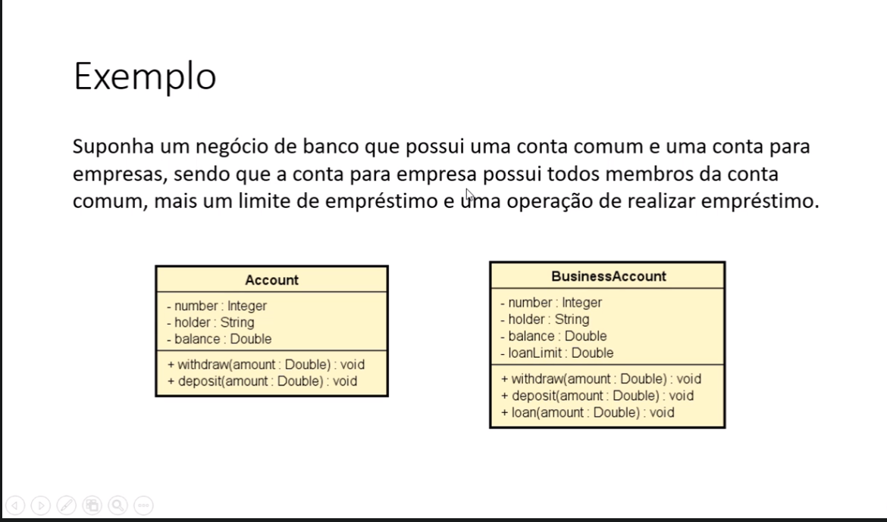
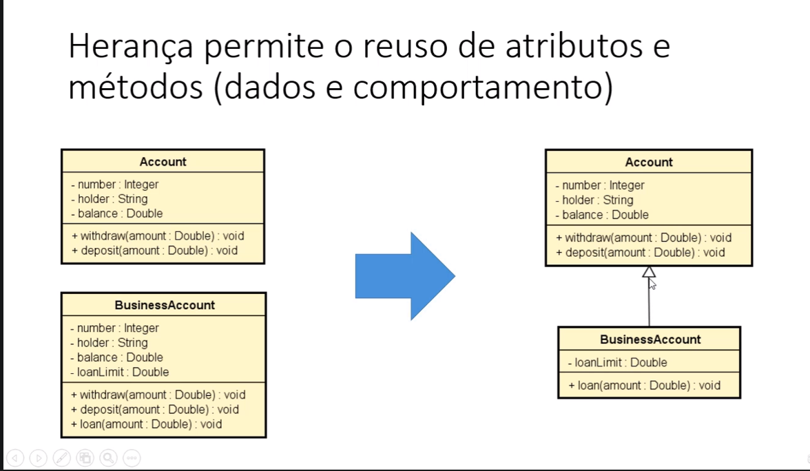
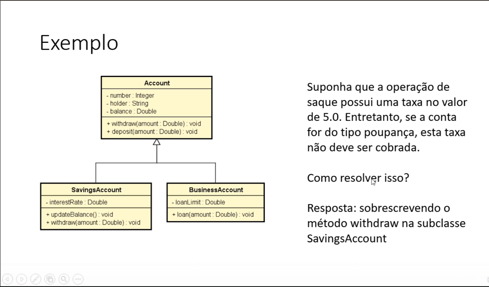

# PROGRAMAÇÃO ORIENTADA A OBJETO.

## Classe
- É um tipo estruturado que pode conter (membros):
    - Atributos (dados / campos)
    - Métodos (funcões / operacões)
* A classe também pode prover muitos outros recursos, tais como:
    - Construtores 
    - Sobrecarga
    - Encapsulamento
    - Heranca
    -  Polimorfismo

- Exemplos: 
    - Entidades: Produto, Cliente, Triangulo
    - Servicos: ProdutoService, ClienteService, EmailService, StorageService
    - Controladores: ProdutoController, ClienteController
    - Utilitários: Calculadora, Compactador
    - Outros (views, repositórios, gerenciadores, etc.)


## Classes, objetos, atributos
- classe: é a definicão do tipo.
- Objetos: são instâncias da classe.


### Discussão: 

Quais os benefícios de se calcular a área de um triângulo por meio de uma MÉTODO 
dentro da CLASSE Triangle?

1) Reaproveitamento de código: nós eliminamos o código repetido (cálculo das áreas
dos trŝngulod x e y) no programa principal.
2) Delegacão de responsabilidades: quem deve ser responsável por saber como calcular a área
de um triângulo é o próprio triângulo. A lógica do cálculo da área não deve estar em
outro lugar.

isso se chama principio de COESÃO.

# Segundo exercícios


### 
### Discussão
- Toda classe Java é uma subclasse da classe Object
- Object possui os seguintes métodos:
  - getClass = retorna o tipo de objeto
  - equals = compara se o objeto é igual a outro
  - hashCode = retorna um código hash do objeto
  - toString = converte o objeto para string

## Membros estéticos
- Também chamados membros de classe
  - Em oposicão a membros de instância
- São menbros que fazem sentido independetemente de objetos. Não precisam de objeto para serem chamados.
São chamados apartir do próprio nome da classe.

- Aplicacões comuns:
  - Classes utilitárias => Math.sqrt(double)
  - Declarocões de constantes

- Uma classe que possui somente membros estéticos, pode ser uma classe estética também. Esta classe não poderá 
ser instanciada.


# Construtores. palavra this, sobrecarga, encapsulamento

## Construtores:
 - É uma operacão especial da classe, que executa no momento da instanciacão do objeto
 - Usos comuns:
  - Iniciar valores dos atributos
  - Permitir ou obrigar que o objeto receba dados / dependências no momento de sua 
    instaciacão(Injecão de dependência)
 - Se um construtor customizado não for especificado, a classe disponibiliza o construtor padrão:
 ```sh
  Product p = new Product();
``` 
- É possivel especificar mais de um construtor na mesma classe (sobrecarga)


## Palavra this
- É uma referência para o próprio objeto
- Uso comuns:
  - Diferenciar atributos de variáveis locais
  - Passar o próprio objeto como argumento na chamada de um método ou construtor



## Sobrecarga (Construtores)
- É um recurso que uma classe possui de oferecer mais de uma operacão com o mesmo nome,
porém com diferentes listas de parâmetros.
- São construtores com da classe com parametros diferentes.

## Encapsulamento (getters e setters)
- É um princípio que consiste em esconder detalhes de implementaćão de uma classe,
expondo apenas operacões seguras que mantenham os objetos num estado consistente.
-  Regra de ouro: o objeto deve sempre estar num estado consistente, e a própria 
classe deve garantir isso.
- GET busca os valores 
- SET modifica 
## Modificadores de acesso 
- private: o membro só pode ser acessado na própria classe
- (nada): o membro só pode ser acessado nas classes do mesmo pacote
- protected: o membro só pode ser acessado no mesmo pacote, bem como 
em Subclasses de pacotes diferentes
- public: o membro é acessado por todas as classes (ao menos que ele resida em um 
módulo diferente que não exporte o pacote onde ele está)

## Tipos referência vs. Tipo valor

### Classes são tipos referência 
- Variáveis cujo tipo são classes não devem ser entendidas como caixas, mas sim 
"tentáculos" (ponteiros) para caixas.
- Tipo referência aceita o valor "null", que indica que a variável aponta para ninguém. 



### Tipos primitivos são tipos valor
- Em java, tipos primitivos são tipos valor. Tipos valor são CAIXAS e não ponteiros.


## Desalocamento de memória 
- Objetos alocados dinamicamente, quando não possuem mnais referência para eles, 
serão desalocados pelo garbage collector.
- Variáveis locais são desalocadas imediatamente assim que seu escopo local sai de execucão.

# Vetores
- Em programacão, "vetor" é o nome dado a arranjos unidimensionais
- Arrajo (Array) é uma estrutura de dados:
  - Homogênia (dados do mesmo tipo)
  - Ordenada (elemento acessados por posicões)
  - Alocada de uma vez só, em bloco contíguo de memória
## Vantagems
- Acesso imediato aos elementos pela sua posicão

## Desvantagem
- Tamanho fixo
- Dificuldade para insercões e delecões

## Boxing
- É o processo de conversão de um objeto tipo valor parra um objto tipo referência compativel
```jshelllanguage
int x = 0;
Object obj = x;
```
## unboxing
-  É o processo de conversão de um objeto tipo referência para um objeto tipo valor
```jshelllanguage
int x = 20;
Object obj = x;
int y = (int) obj;
```
# Wrapper classes

```jshelllanguage
int x = 20;
Integer obj = x;
int y = obj;
```
## for each
- Sintaxe opcional e simplificada para percorrer colecões
```sh
for (String obj : vect){
  System.out.println(obj);
}
```
# Listas
- Lista é uma estrutura de dados:
  - Homogênea (dados do mesmo tipo)
  - Ordenada (elementos acessados por meio posicões)
  - Inicia vazia, e seus elementos são alocados sob demanda
  - Cada elemento ocupa um "nó" (ou nodo) da lista
  - Não usa tipos primitivos (int, double etc)
- Lista é do tipo Interface e não pode ser instânciado
- Classes que implementam: ArrayList, LinkedList, etc.

## Vantagens:
- Tamanho variável
- Facilidade de insercão e delecões
## Desvantagens
- Acesso sequencial aos elementos* (Algumas classes otimizam essa desvantangem, tipo a ArrayList)

# Lista parte 2 (HandSon)



# Matrizes
- Em programacão, "matriz" é o nome dado ao aranjos bidimensionais
  - Atencão: "vetor de vetores"
- Arranjo (array) é uma estrutura de dados:
 - Homogênea (dados do mesmo tipo)
 - Ordenada (elementos acessados por meio de posicões)
 - Alocada de uma vez só, em um bloco contíguo de memória

## Vantagens
- Acesso imediato aos elementos pela sua posicão

## Desvantagens
- Tamanho fixo
- Dificuldade para se realizar insercões e delecões

# Trabalhando com Datas
- Data-hora local
  - LocalDate
  - LocalDateTime
- Data-hora global
  - Instant
- Duracão
  - Duration
- Outros
  - ZoneId
  - ChronoUnit
# Enumeracões
- É um tipo especial que serve para especificar de forma literal um conjunto de constantes relacionadas 

- Palavra chave em java: enum

- Vantagem: Melhor semântica, código mais legível  e auxiliado pelo compilador

# Composicão
- É um tipo de associacão que permite que um objeto contenha outro
- Relacão "tem-um" ou "tem-vários"
- Vatangens
  - organizacão: divisão de responsabilidades (cada classe tem sua responsabilidades)
  - Coesão: cada objeto é reponsavel por um única coisa, não deve misturar muita coisa no mesmo lugar
  - Flexibilidade: vc trabalhar com algo que esta dividido em partes é mais flexivel 
  - Reuso: o mesmo objeto pode ser usado em mais de um lugar
- Nota: Embora o Símbolo UML para composicão(todo-parte) seja o diamante preto, neste contexto
estamos chamando de composicão qualquer associacão tipo "tem-um" e "tem-vários"
#
- 
#
- Tem composicão em "Entities" mas também pode acontecer com "Service"
#

#
# Heranca e Polimorfismo 
#
## Heranca
- É um tipo de assiciacão que permite que uma classe herde todos dados e comportamento de outra
- Vantagens 
  - Reuso
  - Polimorfismo
- Sintaxe
  - class A extends B
- Definicões importantes 
  - Relacão "é-um"
  - Generalizacão/especializacão
  - Superclasse(classe base) / subclasse(classe derivada)
  - Heranca/extensão
  - Heranca é uma associacão entre classes (e não entre objetos)
## Exemplo


#
# Upcasting
- Casting da sub classe para superclasse
- Uso comum: polimorfismo
#
# Downcasting
- Casting da suprclasse para subclasse
- Palavra instanceof
- Uso comum: método que recebem parâmetros genéricos(ex:equals)
#
## Instanceof
- Usado para comparar se a variavel é instancia de tal classe
#
# Sobreposicão ou Sobrescrita
- É a implementacão de um método de uma superclasse na subclasse
- É fortemente recomendável usar anotacão @Override num método sobrescrito
  - Facilita a leitura e compreensão d o código
  - Avisamos ao compilador(boa prática)
#

#
# Palavra Super
- É possível chamar a implementacão da superclasse usando a palavra SUPER
- Exemplo: suponha que, na classe BusinessAccount, a regra para saque seja realiazar o saque normalmente da superclasse
descontar mais 2.0
```javascript
@Override
public void withdraw(double amount) {
    super. withdraw(amount);
    balance -= 2.0;
        }
```